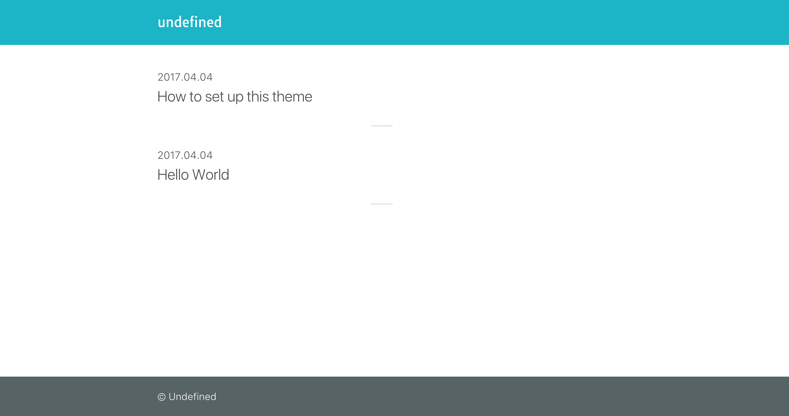

# gatsby-starter-undefined
Gatsby starter for creating a blog

## Features
* Simple Layout
* Select a theme (primary/secondary color)
* Select a syntax highlight theme (based on highlight.js)
* Support for Google Analytics
* Support for Japanese Font
* Author Bio

## Demo
[https://undefined.netlify.com/](https://undefined.netlify.com/)

## Install
Install this starter (assuming Gatsby is installed) by running from your CLI: `gatsby new blog https://github.com/kentaro-m/gatsby-starter-undefined`

## Running in development
```
$ gatsby develop
```

## Screen Shots

Top page


Single page

## License
MIT
